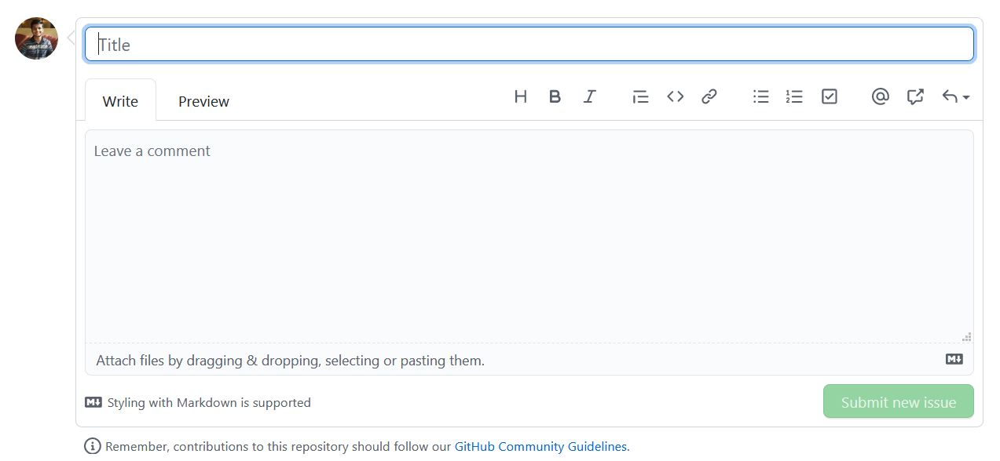
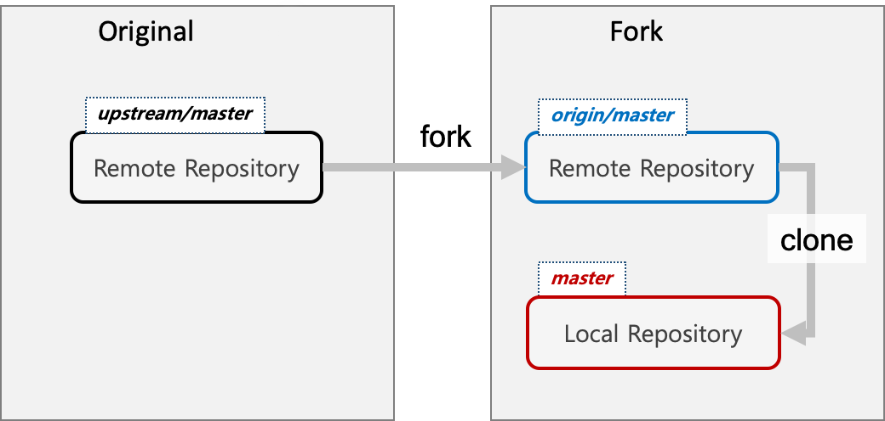
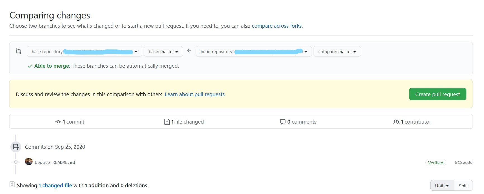

# AlgoCode
[](https://forthebadge.com)
[](https://forthebadge.com)
[](https://forthebadge.com)
[](https://forthebadge.com)


Hey there!👋 

## What can you do here?
* You can solve questions put up by contributors.
* You can put up a problem yourself.

## Steps to put up an issue:

First let's see when should you create an issue?
* If you want to contribute a question.
* If you have a better solution to an existing solved issue.

### To create an issue:

Click on the [Issue button](https://github.com/pratik-choudhari/AlgoCode/issues) at top of the page:<br>


Click new issue and fill up the details!<br>


__Note: Issues must clearly mention what they are addressing, if a problem is being put up then explain it using an example.__

## Get contributing🤩

First things first, In order to contribute you have to create a Pull Request from your forked repo which is a remote clone of this upstream repository.<br>


1. Click this button at the top of screen to fork this repo:<br>
    

2. Now head over to the forked repository and copy the clone HTTPS URL:<br>
    


3. Next up clone the forked repo on to the local machine using:<br>

    ``git clone <copied-fork-link>``
    
4. It is critical to keep your [forked repository in sync the upstream](https://www.freecodecamp.org/news/how-to-sync-your-fork-with-the-original-git-repository/) repository so merge conflicts can be avoided:
    ```
    git remote add upstream https://github.com/pratik-choudhari/AlgoCode.git
    git fetch upstream
    git pull upstream master
    git push
    ```
4. Create a seperate branch to work on:<br>

    The branch name must be selected according to the issue<br>

    ``git checkout -b <branch-name>``

5. After the contribution work is ready go ahead and add it to staging area:<br>

    ``git add -A``

6. Now it is time to commit your changes and sync these changes to forked repo:<br>

    ``git commit -m <your_message>``

    ``git push origin <branch-name>`` 


7. Issue a [pull request](https://www.freecodecamp.org/news/how-to-make-your-first-pull-request-on-github/) from forked repo to this repo:<br>
    * Head over to `Pull Request` tab in the forked repo and click on `New Pull Request`
        
    * Verify base and head repository name and branch names.
        
    * Fill in the title and provide a concise description.
        
    
8. Wait for respose on the PR. Congratulations you just contributed to open source!

9. Get your name in CONTRIBUTORS.md!

## About me

Hi! I am Pratik Choudhari an undergrad student. Recently I have discovered my liking for open source since then I have been working diligently towards it and here I am with this repository😄.

Got something interesting to talk about? I would love to hear back from you!

Let's connect


<a href="https://www.linkedin.com/in/pratik-choudhari/"></a>
<a href="https://github.com/pratik-choudhari/"></a>


