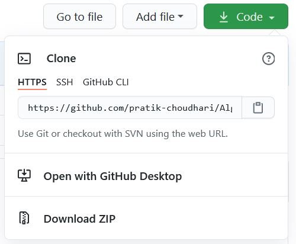
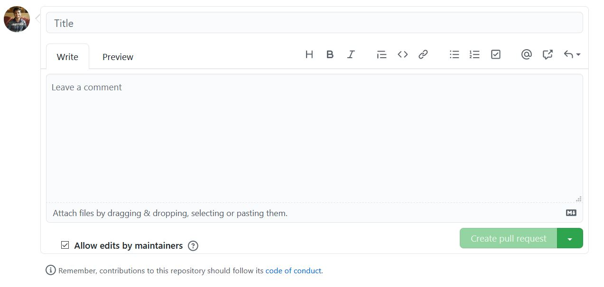

# AlgoCode

Hey there!👋 

## What can you do here?
* Here you can solve questions put up by me and other contributors.
* If you have a coding problem in your mind, feel free to create an issue.

## Steps to put up an issue:

First let's see when should you create an issue?
* If you want to contribute a question, [visit here](https://github.com/pratik-choudhari/AlgoCode/issues).
* If you have a better solution to an existing solved issue.

### To create an issue:

Click on the issue button at top of the page

Click new issue and fill up the details!

__Note: Issues must clearly mention what they are addressing, if a problem is being put up then explain it using an example.__

## Get contributing🤩

1. First things first, In order to contribute you have to create a Pull Request from your forked repo which is a remote clone of this upstream repository.

    Click this button at the top of screen to fork this repo:
    

2. Now head over to the forked repository and copy the clone HTTPS URL
    

3. Next up clone the forked repo on to the local machine using:

    ``git clone <copied-fork-link>``

4. Create a seperate branch to work on:

    The branch name must be selected according to the issue

    ``git checkout -b <branch-name>``

5. After the contribution work is ready go ahead and add it to staging area:

    ``git add -A``

    Now it is time to commit your changes and sync these changes to forked repo:

    ``git commit -m <your_message>``

    ``git push origin <branch-name>`` 

7. Issue a pull request from forked repo to this repo.
    * Head over to `Pull Request` tab in the forked repo and click on `New Pull Request`
        
    * Verify base and head repository name and branch names.
        
    * Fill in the title and provide a concise description.
        
    
8. Wait for respose on the PR. Congratulations you just contributed to open source!

9. Get your name in CONTRIBUTORS.md!

## About me

Hi! I am Pratik Choudhari an undergrad student. Recently I have discovered my liking for open source since then I have been working diligently towards it and here I am with this repository😄.

Got something interesting to talk about? Let's connect on 

